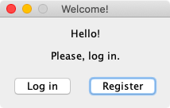
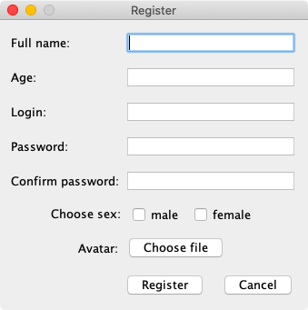
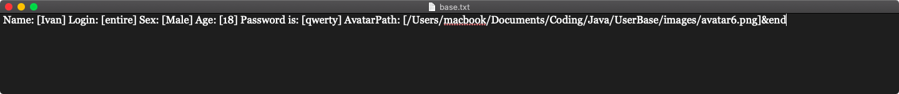
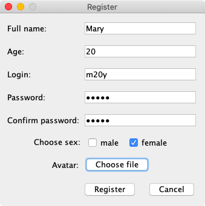
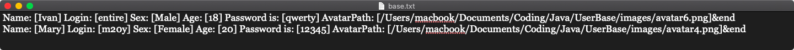
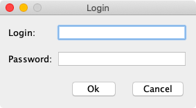
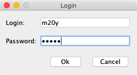
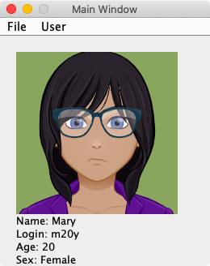

# User base system

    In the course of this project, I created an application 
    that is a database of users, with the ability to register 
    new users by creating new accounts and adding them to the database. 
    As well as using the visual modeling language UML diagrams were constructed: 
- Use-case diagrams 
- Sequence diagram 
- Cooperation diagrams 
- Class diagram 
- States (statechart diagram) 
The software implementation was performed using the Java programming language. 

    When you start the program, the first window opens (StartWindow) with the 
    further possibility to choose registration or login to an already registered account: 
     
    When you open the RegisterWindow, we see the following form: 
     
    Until we registered a new user, the database looks like this: 
     
    Fill in the registration form: 
     
    After adding a new user, the database looks like this: 
     
    The following is the login window: 
     
    Fill in the fields: 
     
    Following, if such a user is found in the database, an account window (MainWindow) will open: 
     

